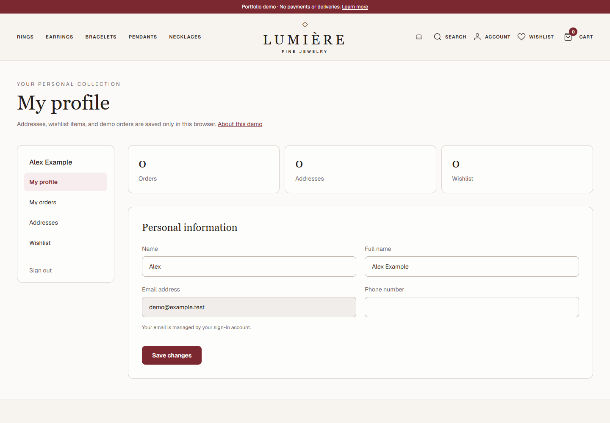
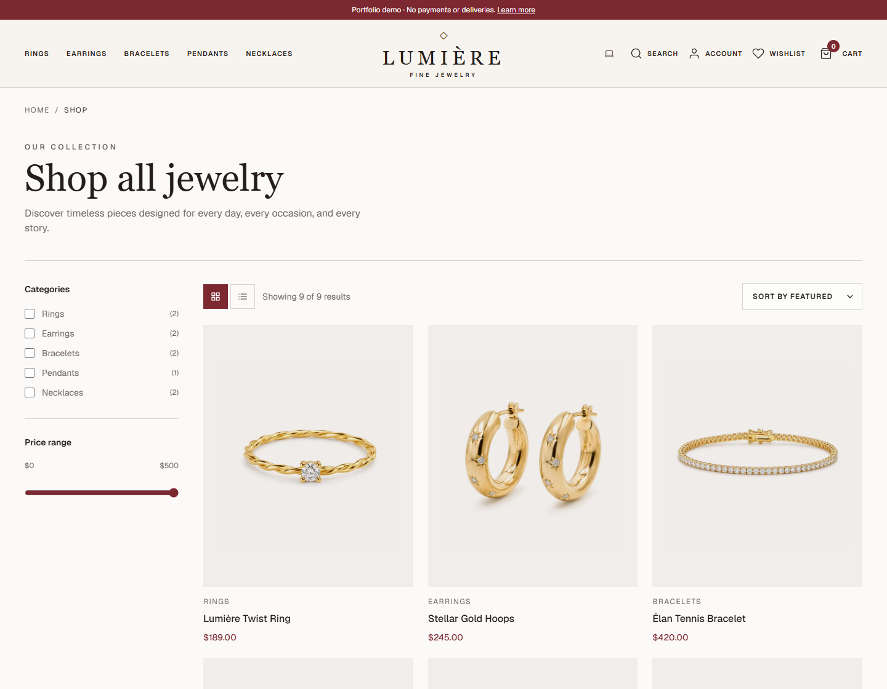
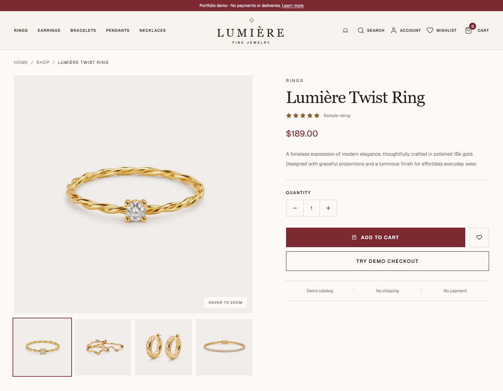
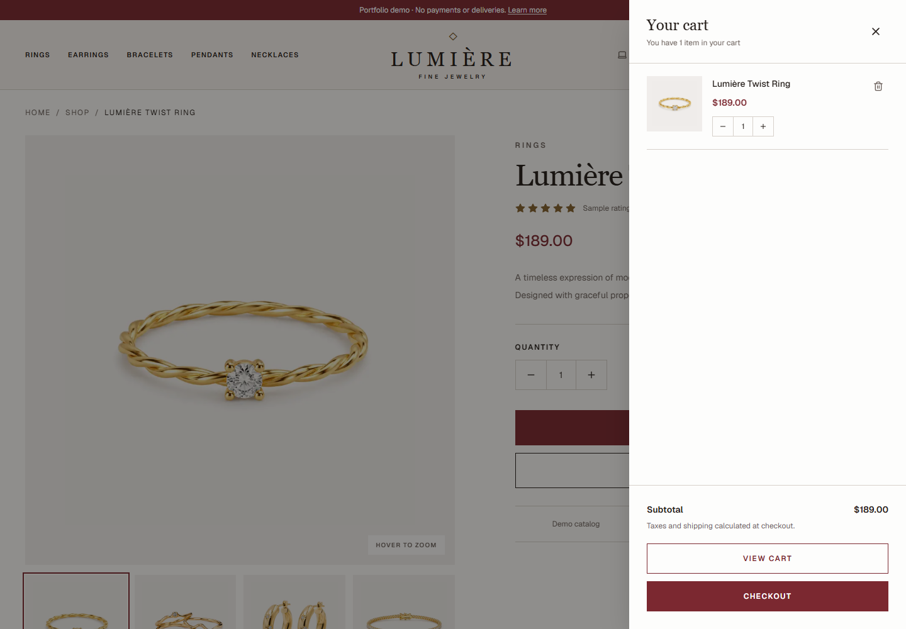
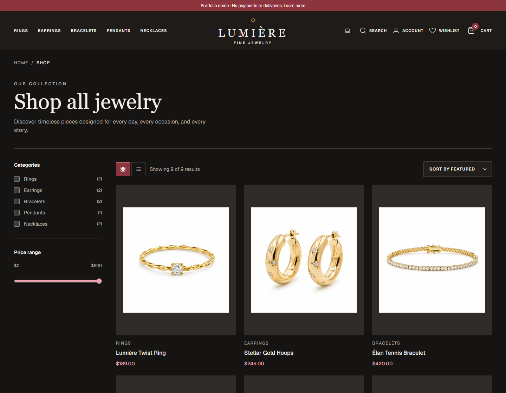
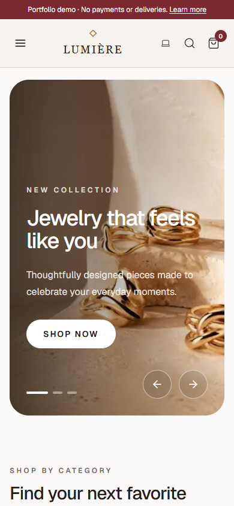

<div align="center">

# Lumière · Fine Jewelry

**A fine-jewelry storefront and customer dashboard built with Next.js, React, TypeScript, and Supabase.**

Explore a complete demo shopping journey: discover jewelry, save favorites, manage your account, and place a demo order. Responsive layouts and light/dark themes bring the experience to desktop and mobile.

[Screenshots](#screenshots) · [Features](#experience-at-a-glance) · [Tech stack](#tech-stack) · [Run locally](#run-locally) · [Developer](https://github.com/farnazbina)


</div>

## The project

Lumière brings a fine-jewelry brand to the web through warm neutrals, burgundy accents, editorial imagery, and spacious layouts. The experience spans collection discovery, product exploration, a shared cart, and a three-step checkout interface.

Built as a frontend portfolio project, it demonstrates component composition, responsive design, typed data modeling, interactive React state, and Supabase authentication. Commerce screens currently use demo data; the repository also includes a PostgreSQL schema for future backend integration.

## Experience at a glance

| Area | What's implemented |
| --- | --- |
| Homepage | Rotating hero carousel, category navigation, best sellers, campaign banner, and testimonials |
| Catalog | Category and price filters, sorting, grid/list views, mobile filter panel, and empty results state |
| Product details | Selectable image gallery, pointer-based hover zoom, quantity selector, information tabs, and related products |
| Product search | Header search with product previews, matching results, and a dedicated catalog search state |
| Cart | Shared Zustand state across the cart page, responsive drawer, and checkout; quantity updates, item removal, totals, and empty states |
| Customer dashboard | Profile overview with order, address, and wishlist counts; editable personal information and account navigation |
| Saved collections | Wishlist, saved delivery addresses, demo order history, and individual order details |
| Checkout prototype | Saved-address selection, demo acknowledgement, review, and locally saved order details |
| Authentication | Supabase sign-up, login, email confirmation, password recovery, and password update flows |
| Themes and mobile | Light/dark themes, responsive navigation, mobile filters, and a cart bottom sheet |
| Database foundation | SQL tables for profiles, products, categories, carts, favorites, orders, order items, and transactions, with row-level security policies |

## Screenshots

Actual browser captures of the application. The customer dashboard uses a fictional test account with mocked authentication; product content is demo data. Click any image to view it at full size.

### Customer dashboard / overview

The `/profile` page brings account navigation, saved-item counts, and personal information into one view.



### Browse and discover

| Product catalog | Product details |
| :---: | :---: |
| [](docs/screenshots/catalog.png) | [](docs/screenshots/product-details.png) |

### Shopping interactions and themes

| Cart drawer | Dark theme |
| :---: | :---: |
| [](docs/screenshots/cart-drawer.png) | [](docs/screenshots/catalog-dark.png) |

<details>
<summary><strong>See the mobile storefront</strong></summary>
<br />

</details>

## Engineering highlights

- **Reusable commerce components.** Shared catalog data and product types support the listing, detail, cart, and review screens. Checkout steps reuse progress and order-summary components.
- **Responsive interaction design.** Desktop filters become a mobile panel, the cart drawer becomes a bottom sheet on smaller screens, and product layouts adapt across breakpoints.
- **Shared commerce state.** Zustand keeps cart quantities and totals consistent across the drawer, cart page, and checkout. Catalog filters and sorting use derived values, while galleries keep interaction state local.
- **Account persistence.** Addresses, wishlist items, and demo orders use validated browser storage scoped to the signed-in user. Profile updates go through Supabase Auth.
- **Next.js application structure.** App Router routes organize the storefront and authentication pages, while `next/image` provides responsive image sizing and priority loading for featured imagery.
- **Authentication boundaries.** Separate browser and server Supabase clients, cookie-based session handling, and an email-confirmation route support the account lifecycle.
- **Database access rules in source control.** The SQL schema defines customer ownership and administrator policies, making the intended data-access model reviewable alongside the frontend.

### Start your code review here

| Code | What to look for |
| --- | --- |
| [ShopCatalog.tsx](components/shop/ShopCatalog.tsx) | Filter composition, sorting, category query-parameter support, and responsive view controls |
| [ProductDetails.tsx](components/shop/ProductDetails.tsx) | Gallery state, pointer-position zoom, and product presentation |
| [CartPage.tsx](components/cart/CartPage.tsx) | Quantity updates, derived totals, removal, and empty-cart handling |
| [Cart store](stores/cart-store.ts) | Shared Zustand state and selectors |
| [Account components](components/account) | Profile overview, addresses, wishlist, and order history |
| [Account data](lib/account-data.ts) | Stored-data validation and demo order calculations |
| [Checkout components](components/checkout) | Composition across address, payment, and review steps |
| [Supabase clients](lib/supabase) | Browser/server client separation and session handling |
| [Database schema](supabase/schema.sql) | Relational modeling and row-level security policies |

## Tech stack

| Purpose | Tools |
| --- | --- |
| Application | Next.js 16 App Router, React 19, TypeScript |
| Styling and themes | Tailwind CSS 3, CSS variables, tailwindcss-animate, next-themes |
| UI primitives and icons | Radix UI, Lucide, React Icons |
| Client state | Zustand for the cart; React context and local storage for account data |
| Authentication and database foundation | Supabase Auth, PostgreSQL, Supabase SSR |
| Code quality and testing | ESLint, TypeScript, Node.js test runner, Playwright |
| Package management | pnpm with a committed lockfile |

## Run locally

Use Node.js 22.6+ (for the included TypeScript unit-test command), pnpm, and a Supabase project for authentication.

```bash
git clone https://github.com/farnazbina/nextjs-e-commerce.git
cd nextjs-e-commerce
pnpm install --frozen-lockfile
```

Create `.env.local` in the project root with your Supabase project's public connection values:

```dotenv
NEXT_PUBLIC_SUPABASE_URL=https://your-project.supabase.co
NEXT_PUBLIC_SUPABASE_PUBLISHABLE_KEY=your-supabase-publishable-key
```

For local authentication, configure your Supabase Auth site URL as `http://localhost:3000` and allow `http://localhost:3000/profile` and `http://localhost:3000/auth/update-password` as redirect URLs. Email confirmation is handled by the route in [app/auth/confirm/route.ts](app/auth/confirm/route.ts); confirmation emails using this route need `token_hash` and `type` query parameters.

To provision the commerce database foundation, run [supabase/schema.sql](supabase/schema.sql) once in a fresh Supabase project's SQL Editor. The storefront's demo catalog does not depend on these tables yet.

```bash
pnpm dev
```

Open [localhost:3000](http://localhost:3000). Browse `/products`, open `/products/1`, explore `/cart`, and follow `/submit-order` through the checkout prototype. Account flows begin at `/auth/login` and `/auth/sign-up`.

After signing in, visit `/profile` for the dashboard, `/addresses` to save a fictional delivery address, `/wishlist` for favorites, and `/orders` for demo order history.

| Command | Purpose |
| --- | --- |
| `pnpm dev` | Start the development server |
| `pnpm lint` | Run ESLint |
| `pnpm exec tsc --noEmit` | Check TypeScript types |
| `pnpm test:unit` | Test account-data validation and demo order calculations |
| `pnpm test:browser` | Run Playwright flows against a production build; requires Google Chrome |
| `pnpm build` | Create a production build |
| `pnpm start` | Serve the production build |

## Project structure

```text
app/
  (store)/          Storefront, products, cart, checkout, and account routes
  auth/             Account pages and email confirmation
  protected/        Protected starter page
components/
  home/             Homepage sections
  shop/             Catalog, filters, and product details
  cart/             Interactive cart page
  checkout/         Address, payment, review, and shared summaries
  auth/             Authentication components
  account/          Dashboard, profile, addresses, wishlist, and orders
  layout/           Header, footer, and cart drawer
  ui/               Shared UI primitives
lib/
  data/             Typed demo catalog and checkout fixtures
  supabase/         Browser/server clients and session handling
  account-data.ts   Per-user storage validation and demo order creation
stores/             Shared Zustand cart
docs/screenshots/   Actual application captures used in this README
tests/              Account-data unit tests and Playwright browser flows
public/images/      Hero, category, product, and testimonial assets
supabase/           SQL schema, migrations, and local configuration
```

## Current scope and next steps

This is a portfolio demo, not a live store. Catalog and ratings are sample content. Cart state is shared between the drawer, cart page, and checkout, but resets on a full reload. Addresses, wishlist items, and demo orders persist in this browser separately for each Supabase user. Profile fields are saved through Supabase Auth. No card details are collected and no payments or deliveries occur.

Real inventory, cross-device commerce storage, payments, transactional order emails, and an admin dashboard remain outside V1.

## Release checks

- Run `pnpm lint`, `pnpm test:unit`, and `pnpm build`.
- Run `pnpm test:browser` after building. The suite launches the production app on port 3100 and uses installed Google Chrome. It checks 320px and 1440px layouts in both themes and tests registration, profile editing, addresses, wishlist removal, demo ordering, persistence, and logout with mocked Supabase responses. It does not send email or verify a live Supabase deployment.
- Set `TEST_BASE_URL` to run the browser suite against an existing preview. Auth remains mocked in this suite; use a separate test account for live auth checks.
- Configure the deployed origin as the Supabase Auth Site URL. Allow the deployed `/profile` and `/auth/update-password` redirects (and localhost equivalents for development).
- For token-hash confirmation emails, point the signup template to `{{ .SiteURL }}/auth/confirm?token_hash={{ .TokenHash }}&type=email&next=/profile`. Recovery emails using that route must use `type=recovery&next=/auth/update-password`.
- On the deployed domain, manually register a test account, follow its confirmation email, log in, save a profile, sign out, and test password recovery. These checks require the final domain, Supabase redirect settings, and access to the test inbox.

## Developer

Built by [@farnazbina](https://github.com/farnazbina).

For frontend opportunities or a discussion of the implementation, visit my [GitHub profile](https://github.com/farnazbina). This repository showcases my work with React, Next.js, TypeScript, responsive interfaces, and Supabase integration.
